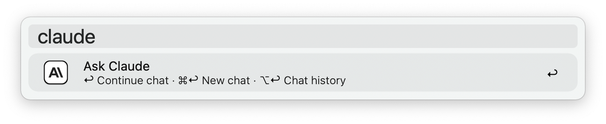
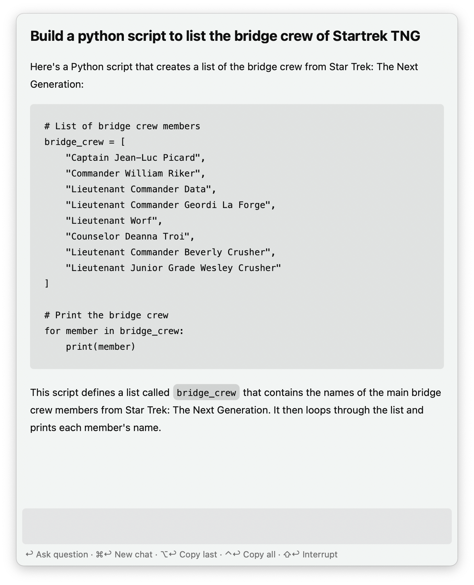
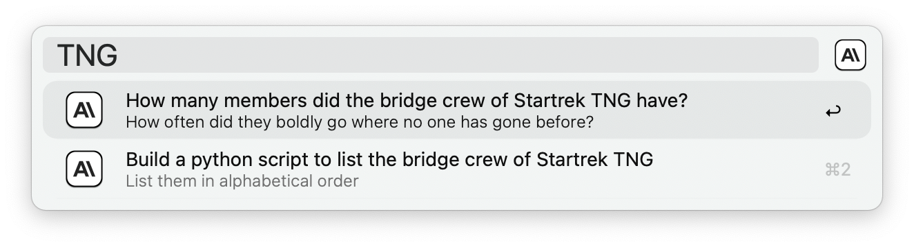

#  Claude AI Alfred Workflow

This is a modified version of the official Alfred ChatGPT workflow to interact with Anthropic's API instead of OpenAI's.

---

## Setup

1. Create an Anthropic account and [log in](https://console.anthropic.com/login).
2. On the [API keys page](https://console.anthropic.com/settings/keys), click `Create Key`.
3. Name your new secret key and click `Create Key`.
4. Copy your secret key and add it to the [Workflow’s Configuration](https://www.alfredapp.com/help/workflows/user-configuration/).

## Usage

### Claude

Query Claude via the `claude` keyword, the [Universal Action](https://www.alfredapp.com/help/features/universal-actions/), or the [Fallback Search](https://www.alfredapp.com/help/features/default-results/fallback-searches/).

* <kbd>↩</kbd> Ask a new question.
* <kbd>⌘</kbd><kbd>↩</kbd> Clear and start new chat.
* <kbd>⌥</kbd><kbd>↩</kbd> Copy last answer.
* <kbd>⌃</kbd><kbd>↩</kbd> Copy full chat.
* <kbd>⇧</kbd><kbd>↩</kbd> Stop generating answer.

#### Chat History

View Chat History with ⌥↩ in the `chatgpt` keyword. Each result shows the first question as the title and the last as the subtitle.

<kbd>↩</kbd> to archive the current chat and load the selected one. Older chats can be trashed with the `Delete` [Universal Action](https://www.alfredapp.com/help/features/universal-actions/). Select multiple chats with the [File Buffer](https://www.alfredapp.com/help/features/file-search/#file-buffer).